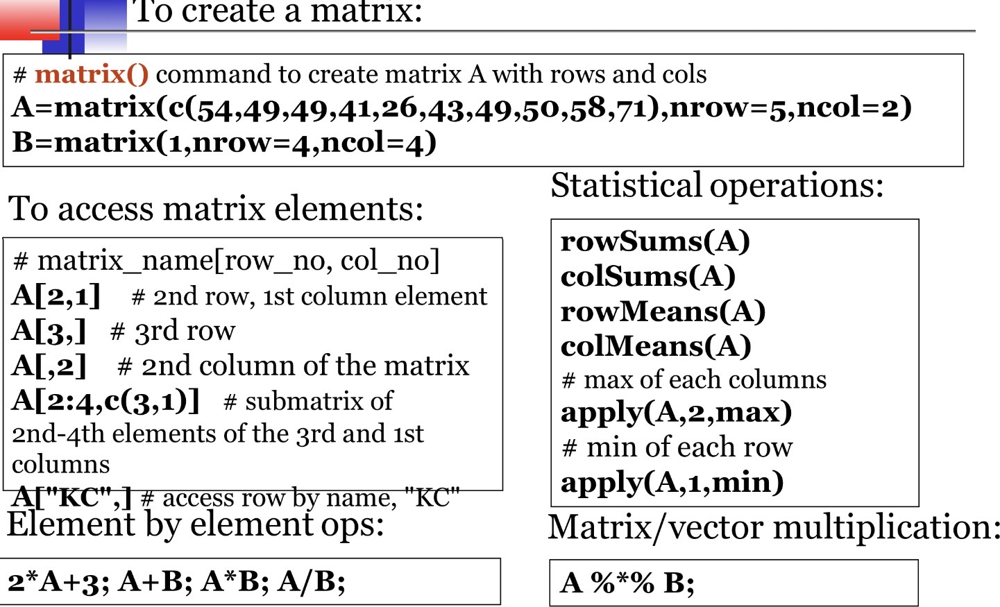

# Data Types
### Character
  - Used to specify a character or character string.
  - Use single quotes for a character (e.g., 'A') or double quotes for a character string (e.g., "Apple").

### Int 
  - Specifies whole numbers.
  - Use the suffix "L" to specify integer data (e.g., 123L).

### Numeric
  - Represents all real numbers with or without a decimal point (e.g., 125 or 125.0).

### Complex
  - Represents numeric values with an imaginary part. The suffix "i" is used to specify the imaginary part (e.g., x <- 2 + 3i).

### Logical
  - A Boolean data type that takes values TRUE or FALSE.

### Raw (Real Numbers)
  - Represents all real numbers.

### Vector
  - A set of values with the same type (a collection of ordered elements) represented in a one-dimensional array.
  - The `c()` function is used to concatenate multiple elements together into a single vector.
  - Functions
    ```
    seq(from, to, by)
      EX: generate a sequence
          indices<-seq(1,10,2) # Numbers 1-10 step by 2
          #indice is c(1,3,5,7,9)
    rep(x, ntimes)
      EX: repeat x n times
          y<-rep(1:3, 2) #Repeats twice with the numbers 1-3
          # y is c(1,2,3,1,2,3)
    cut(x,n)
      EX: Divide continuous variable in factor with n levels
          y<-cut(x,5) 
  - Creating a Vector:
      -
      -
      ```
      #1 means rows
      #2 means cols
      apply(x,1,max)
        26 27 28 29 30
      apply(x,1,min)
        1 2 3 4 5 
      apply(x,2,max)
        5 10 15 20 25 30 
      apply(x,2,max)
        1 6 11 16 21 26
    
### Matrix
  - R objects in which the elements are arranged in a two-dimensional rectangular layout, and the elements are of the same atomic type.
  - How to create a matrix
    ```
    x<- matrix(c(1:30), nrow=5, ncol=6)
    #prints 1-30 going down so vertically last row 5,10,15,20,25,30

    #Naming rows and columns
    rownames(x)<-c('Row1', 'Row2', 'Row3', 'Row4', 'Row5')
    colnames(x)<-c('A','B','C','D','E','F')
    # OUTPUT
         A  B  C  D  E  F
    Row1 
    Row2
    Row3
    Row4
    Row5 
    ```
  - 

### List
  - Flexible R objects with irregular or non-rectangular data structures.
  - Lists may contain vectors, matrices, or other lists.

### Data Frame
  - A data frame may be regarded as a matrix with columns possibly of differing modes and attributes. It can be displayed in matrix form, and its rows and columns can be extracted using matrix indexing conventions.

### Factor
  - A categorical variable that stores both string and integer values as levels.
  - Factors are commonly used in statistical modeling and exploratory data analysis with R.
