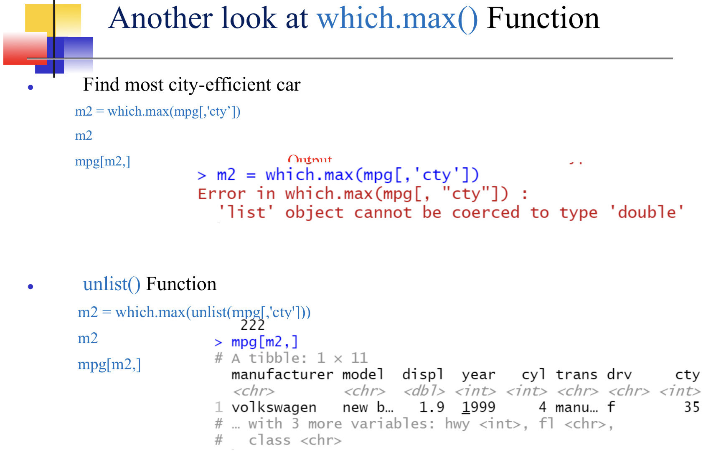

# which()
```
which.max(data_frame$column_name)
#Finding the oldest person in the list or set

Name<-c("Mary", "Joe", "Peter", "Pam", "Lucy")
Age<-c(23, 19, 30, 55, 26)
df<-data.frame(Name, Age)
n = which.max(df$Age)
df[n,]

#Output -> Peter 55
#The same for youngest but n = which.min(df$Age)
```

# Unlist()

